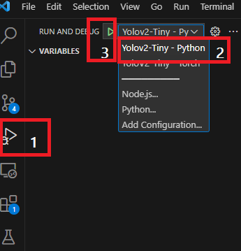
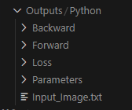

<a name="readme-top"></a>
[![Contributors][contributors-shield]][contributors-url]
[![Forks][forks-shield]][forks-url]
[![Stargazers][stars-shield]][stars-url]
[![Issues][issues-shield]][issues-url]
[![MIT License][license-shield]][license-url]
[![LinkedIn][linkedin-shield]][linkedin-url]


<!-- PROJECT LOGO -->
<br />
<div align="center">
  <a href="https://github.com/ShoaibSajid/Python_CNN/tree/Yolov2-Tiny">
    
  </a>

<h1 align="center">A Convolution Neural Network (CNN) From Scratch
</h2>

  <p align="center">
    We implemented the object detector using simple python code to have in-depth understanding and control over the forward and backward propagation.
    <br />
    <a href="https://github.com/ShoaibSajid/Python_CNN/tree/Yolov2-Tiny"><strong>Explore the docs »</strong></a>
    <br />
    <br />
    <a href="https://github.com/ShoaibSajid/Python_CNN/tree/Yolov2-Tiny">View Demo</a>
    ·
    <a href="https://github.com/ShoaibSajid/Python_CNN/issues">Report Bug</a>
    ·
    <a href="https://github.com/ShoaibSajid/Python_CNN/issues">Request Feature</a>
  </p>
</div>
<p align="right">(<a href="#readme-top">back to top</a>)</p>


 


<!-- TABLE OF CONTENTS -->
## Table of Contents
  <ol>
    <li><a href="#Dependencies">Dependencies</a></li>
    <li><a href="#Usage">Usage</a></li>
    <li><a href="#contributing">Contributing</a></li>
    <li><a href="#license">License</a></li>
    <li><a href="#contact">Contact</a></li>
    <li><a href="#acknowledgments">Acknowledgments</a></li>
  </ol>
</details>
<p align="right">(<a href="#readme-top">back to top</a>)</p>


 


<!-- Dependencies -->
## Dependencies
 
Create an enviornment using the following command.


```bash
conda create -n yolov2_tiny pytorch==1.12.1 torchvision==0.13.1 torchaudio==0.12.1 cudatoolkit=10.2 -c pytorch
```

Install the required packages using the following command
```bash
pip install tqdm matplotlib mnist==0.2.2 numpy
```


<p align="right">(<a href="#readme-top">back to top</a>)</p>


 


<!-- Usage -->
## Usage
You can run this in the command terminal as instructed below.

For python version, run the file as follow
```bash
python yolov2tiny_python.py
```

To run the Pytorch version, run the file as follow
```bash
python yolov2tiny_torch.py
```

To run this in VSCode, you can find the .vscode/launch.json file is already added. Simply run as given in this screenshot.
<br />
  <a href="https://github.com/ShoaibSajid/Python_CNN/tree/Yolov2-Tiny">
    
  </a>

<p align="right">(<a href="#readme-top">back to top</a>)</p>

Once you run the code, it should generate an output as shown in the figure below.
Since the output has a large size so it is not possible to add the output data in the git repository.
<br />
  <a href="https://github.com/ShoaibSajid/Python_CNN/tree/Yolov2-Tiny">
    
  </a>

<p align="right">(<a href="#readme-top">back to top</a>)</p>

 


<!-- CONTRIBUTING -->
## Contributing

Contributions are what make the open source community such an amazing place to learn, inspire, and create. Any contributions you make are **greatly appreciated**.

If you have a suggestion that would make this better, please fork the repo and create a pull request. You can also simply open an issue with the tag "enhancement".
Don't forget to give the project a star! Thanks again!

<p align="right">(<a href="#readme-top">back to top</a>)</p>


 


<!-- LICENSE -->
## License

Distributed under the MIT License. See `LICENSE.txt` for more information.

<p align="right">(<a href="#readme-top">back to top</a>)</p>


 


<!-- CONTACT -->
## Contact

Shoaib Sajid - shoaib.sajid.ss@gmail.com

Project Link: [https://github.com/ShoaibSajid/Python_CNN/tree/Yolov2-Tiny](https://github.com/ShoaibSajid/Python_CNN/tree/Yolov2-Tiny)

<p align="right">(<a href="#readme-top">back to top</a>)</p>


 


<!-- ACKNOWLEDGMENTS -->
## Acknowledgments

* [Sereiwatha Ros](https://github.com/Nayuki-Sunder)
* [Ali Haroon Turk]()
* [Sawera Khurshid]()

<p align="right">(<a href="#readme-top">back to top</a>)</p>


<!-- MARKDOWN LINKS & IMAGES -->
<!-- https://www.markdownguide.org/basic-syntax/#reference-style-links -->
[contributors-shield]: https://img.shields.io/github/contributors/ShoaibSajid/Python_CNN.svg?style=for-the-badge
[contributors-url]: https://github.com/ShoaibSajid/Python_CNN/graphs/contributors
[forks-shield]: https://img.shields.io/github/forks/ShoaibSajid/Python_CNN.svg?style=for-the-badge
[forks-url]: https://github.com/ShoaibSajid/Python_CNN/network/members
[stars-shield]: https://img.shields.io/github/stars/ShoaibSajid/Python_CNN.svg?style=for-the-badge
[stars-url]: https://github.com/ShoaibSajid/Python_CNN/stargazers
[issues-shield]: https://img.shields.io/github/issues/ShoaibSajid/Python_CNN.svg?style=for-the-badge
[issues-url]: https://github.com/ShoaibSajid/Python_CNN/issues
[license-shield]: https://img.shields.io/github/license/ShoaibSajid/Python_CNN.svg?style=for-the-badge
[license-url]: https://github.com/ShoaibSajid/Python_CNN/blob/Yolo/LICENSE
[linkedin-shield]: https://img.shields.io/badge/-LinkedIn-black.svg?style=for-the-badge&logo=linkedin&colorB=555
[linkedin-url]: https://www.linkedin.com/in/shoaibsajid/